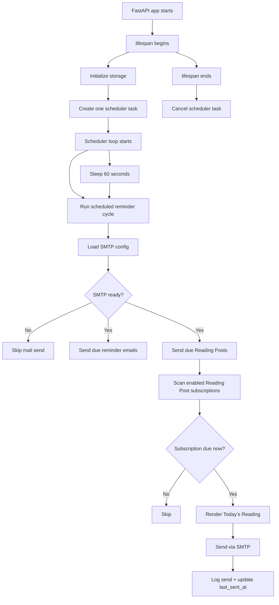

# Reading Post Scheduler Design

This document describes how Boa schedules and sends Reading Post emails.
It records the current design as of Boa 3.2.1, including the engine-room
timezone rule, the polling cadence, and the idempotency rules that prevent
duplicate sends.

## Purpose

Reading Post is the journey-level delivery path for the full `Today’s Reading`.
It should feel like a quiet, reliable background instrument rather than a
manual admin action.

The scheduler exists to answer one question:

> Given the current engine-room time, which journeys are due to send now?

## Current Design

Boa uses one background task for all journeys.

- FastAPI owns the app lifecycle.
- Boa starts a single `asyncio` task during `lifespan`.
- That task wakes up once per minute.
- Each tick scans all enabled Reading Post subscriptions.
- Each subscription decides for itself whether it is due.

Relevant code:

- [`/Users/chengenzo/work/github/boa/src/boa/api.py`](/Users/chengenzo/work/github/boa/src/boa/api.py)
- [`/Users/chengenzo/work/github/boa/src/boa/reading_post_service.py`](/Users/chengenzo/work/github/boa/src/boa/reading_post_service.py)
- [`/Users/chengenzo/work/github/boa/src/boa/clock.py`](/Users/chengenzo/work/github/boa/src/boa/clock.py)

## Lifecycle

## Time Model

Boa uses the engine room as the source of truth for time.

- `TZ` defines the engine-room timezone.
- Reading Post compares `send_time` against engine-room time, not UTC.
- `send_time` is always stored as `HH:MM`.
- The scheduler treats `08:00` as a minute-level time, not an hour bucket.

That means:

- `08:00` means the `08:00` minute in the engine room.
- The scheduler must check often enough to see that minute.
- Boa currently checks every minute.

## Due Rules

Reading Post is due only when all of these are true:

- The subscription is enabled.
- There is at least one recipient.
- The current date is inside the delivery window.
- The schedule is not `never`.
- The schedule-specific rule is satisfied.

Schedule-specific behavior:

- `daily` - send once per engine-room day after the threshold time.
- `weekdays` - send once per weekday after the threshold time.
- `weekly` - send once per seven days after the threshold time.
- `milestones` - send when one or more milestone dates are due.
- `never` - never send automatically.

The core implementation lives in:

- [`/Users/chengenzo/work/github/boa/src/boa/reading_post_service.py`](/Users/chengenzo/work/github/boa/src/boa/reading_post_service.py)

## Idempotency

The scheduler must not send the same Reading Post repeatedly.

Boa uses `last_sent_at` for that.

- After a successful send, the subscription is marked as sent.
- Subsequent ticks skip the journey until the schedule allows another send.
- This is what keeps a minute-level poller safe.

For milestone-based schedules, Boa also records which milestone dates were already sent.

## Why a Minute Poller

Boa currently uses a minute-level polling loop instead of a more complex job queue.

Why this is a good fit today:

- Small surface area.
- Easy to understand.
- Easy to test.
- One loop can cover all journeys.
- No separate queue worker is needed.

Tradeoff:

- The send happens on the next scheduler tick, not at an exact second.

That tradeoff is acceptable for Boa because Reading Post is a calm delivery path,
not a high-frequency trading system.

## What the Email Contains

Reading Post sends the full `Today’s Reading`.

It includes the current journey reading plus the page notes and related
starlight/storm context that belong in the email body.

The live board can break this apart visually, but the email remains the complete
reading artifact.

Relevant code:

- [`/Users/chengenzo/work/github/boa/src/boa/email_templates.py`](/Users/chengenzo/work/github/boa/src/boa/email_templates.py)

## Verification

The scheduler is covered by tests that assert:

- `send_time` is parsed and normalized correctly.
- `daily`, `weekdays`, `weekly`, and `milestones` behave as expected.
- the scheduler interval is one minute.
- Reading Posts do not double-send once `last_sent_at` is set.

Relevant tests:

- [`/Users/chengenzo/work/github/boa/tests/test_reading_post.py`](/Users/chengenzo/work/github/boa/tests/test_reading_post.py)
- [`/Users/chengenzo/work/github/boa/tests/test_api.py`](/Users/chengenzo/work/github/boa/tests/test_api.py)

## Future Direction

If Boa grows beyond a small number of journeys, the next step would be a more
explicit next-trigger scheduler:

- compute the next due time for each subscription
- sleep until the earliest trigger
- keep `last_sent_at` as the idempotency guard

That would reduce polling work while keeping the same product semantics.
